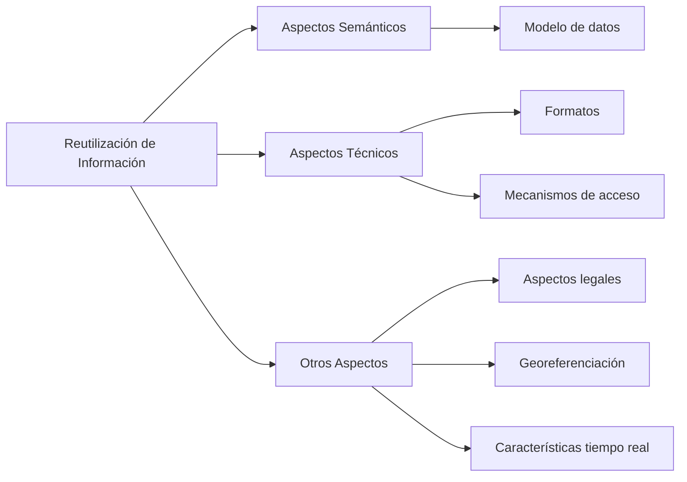

<!--
author: Equipo gestor de la plataforma datos.gob.es
email: soporte@datos.gob.es
date: 01/09/2025
version: 1.0.0
language: es
narrator: Español Female

edit:     true

repository: https://github.com/mjanez/demo-unidad-didactica

logo:     https://cdn.jsdelivr.net/gh/mjanez/demo-unidad-didactica@main/img/logo_dge.svg

comment:  Unidad 06 - Reutilización de la Información del Sector Público: DCAT-AP y la Norma Técnica de Interoperabilidad de Reutilización de Recursos de Información. (NTI-RISP). Más información en [datos.gob.es](https://datos.gob.es/)

          Siéntete libre de editar y mejorar este contenido, y de compartirlo con quien quieras.

script: https://cdn.jsdelivr.net/chartist.js/latest/chartist.min.js
        https://cdn.jsdelivr.net/npm/mermaid@10.5.0/dist/mermaid.min.js

link: https://fonts.googleapis.com/css2?family=Poppins:wght@300;400;500;600;700&display=swap
      https://cdn.jsdelivr.net/gh/mjanez/demo-unidad-didactica@main/css/dge-liascript.css

font: Poppins

@onload
mermaid.initialize({ startOnLoad: false });
@end

@mermaid: @mermaid_(@uid,```@0```)

@mermaid_
<script run-once="true" modify="false" style="display:block; background: white">
async function draw () {
    const graphDefinition = `@1`;
    const { svg } = await mermaid.render('graphDiv_@0', graphDefinition);
    send.lia("HTML: "+svg);
    send.lia("LIA: stop")
};

draw()
"LIA: wait"
</script>
@end

@mermaid_eval: @mermaid_eval_(@uid)

@mermaid_eval_
<script>
async function draw () {
    const graphDefinition = `@input`;
    const { svg } = await mermaid.render('graphDiv_@0', graphDefinition);
    console.html(svg);
    send.lia("LIA: stop")
};

draw()
"LIA: wait"
</script>
@end

-->

# DCAT-AP y la Norma Técnica de Interoperabilidad de Reutilización de Recursos de Información (NTI-RISP)

<div style="text-align: center; margin: 2rem 0;">
<ul class="logo-list primary-logos">
<li><a href="https://digital.gob.es/ministerio/organigrama_organos/SEDIA.html"></a></li>
<li><a href="https://datos.gob.es"></a></li>
<li><a href="https://datos.gob.es/acerca-de-la-iniciativa-aporta"></a></li>
</ul>
</div>


## OBJETIVOS DIDÁCTICOS

Comenzamos presentando los **Objetivos didácticos** de esta Unidad:

> - Comprender qué es DCAT-AP y por qué es necesario para la estrategia europea de datos abiertos.
> - Identificar NTI-RISP como parte del ENI y su relación con el DCAT-AP.
> - Conocer las pautas que dicta la NTI-RISP para una iniciativa de reutilización de la información.
> - Ser capaz de emplear las directrices marcadas por NTI-RISP para diseñar el esquema de URIs.
> - Ser capaz de describir un catálogo, un conjunto de datos y una distribución de acuerdo a como dicta la NTI-RSIP.

## REQUISITOS PREVIOS

Para poder asimilar los conceptos que vamos a desarrollar en la unidad, deberías contar con:

> - [x] Conocimientos técnicos básicos de la utilización o conexión de datos de varias fuentes.
> - [x] Experiencia cualitativa con catálogos de datos.
> - [x] Conocimiento del intercambio de información entre organizaciones.
> - [x] Conocimientos básicos de XML y RDF.

## CONTENIDOS

**Resumimos los aspectos a tratar en los apartados de la Unidad:**

>**[1. INTRODUCCIÓN](#5)**  
>
>> Nos introduce en los conceptos y necesidad de interoperabilidad y el marco europeo de iniciativas relacionadas con el mismo.

>**[2. DCAT-AP](#13)**
>
>> Conocemos este perfil de aplicación o especificación para la descripción de catálogos de conjuntos de datos del sector público en Europa.

>**[3. NTI-RISP](#38)**
>
>>  Se profundiza en la Norma técnica de interoperabilidad, publicada en febrero de 2013, sus objetivos, preceptos y cómo se desarrolla.

## 1. INTRODUCCIÓN

### INTEROPERABILIDAD

> **Definición**
>
> La **interoperabilidad** es la capacidad de dos organizaciones de poder intercambiar información entre ellas. Constituye una necesidad para aquellas organizaciones que tienen que trabajar o cooperar, aunque solo sea en parte, y afecta a múltiples niveles.

En la UE para las administraciones públicas, se ha definido el **Marco europeo de interoperabilidad** que define estos cuatro niveles:

@mermaid(```graph TD
    A[Marco Europeo de Interoperabilidad] --> B[Interoperabilidad Jurídica]
    A --> C[Interoperabilidad Organizativa]
    A --> D[Interoperabilidad Semántica]
    A --> E[Interoperabilidad Técnica]
    
    B --> B1[Marco legal equivalente]
    C --> C1[Objetivos comunes<br/>Procesos coordinados]
    D --> D1[DCAT-AP Europea]
    D --> D2[NTI-RISP Nacional]
    E --> E1[Planificación común<br/>Herramientas compatibles]```)

#### Niveles de Interoperabilidad

| Nivel | Descripción | Ejemplo |
|-------|-------------|---------|
| **Jurídica** | Las actuaciones de una y otra organización que se comunican, tienen un marco legal equivalente y que da soporte a la comunicación o a la colaboración. | Marco normativo común |
| **Organizativa** | Que se puedan establecer objetivos comunes para las organizaciones mediante la utilización de procesos coordinados. | Base de datos de personas de interés con criterios comunes |
| **Semántica** | Vamos a profundizar en ella en esta unidad a través del estudio de sus dos regulaciones más recientes e importantes | DCAT-AP (Europea) y NTI-RISP (Nacional) |
| **Técnica** | Que exista una planificación común de las herramientas de gestión de sistemas de información para posibilitar el traspaso de información. | APIs, protocolos de comunicación |

### MARCO EUROPEO

La comisión europea ha impulsado a través del **Programa ISA¹** la acción 1.1 (Improving semantic interoperability in European e-Government systems), que desarrolla 5 tipos de iniciativas:

> **¹** Interoperability Solutions for European Public Administrations

1. **Desarrollo de vocabularios** para administración electrónica (e-Government Core Vocabularies)
2. **Esquema de metadatos** para la descripción de activos digitales (Asset Description Metadata Schema)
3. **La iniciativa de gestión** de los estándares de datos (European Interoperability Reference Architecture EIRA)
4. **Exploración de los datos enlazados** abiertos del ámbito público (Linked Open Government Data)
5. **Desarrollo y promoción** del perfil de aplicación de catálogos de datos, DCAT-AP (Development & promotion of the DCAT-AP)

> **💡 MÁS INFORMACIÓN**
>
> Además, la Unión Europea ha puesto en marcha una conferencia anual, **"SEMIC Conference"** con el objetivo de crear un espacio para compartir los avances en la interoperabilidad y la gestión de la información pública. La primera de estas conferencias se celebró en 2011 en Bruselas.

### 1.1 Conceptos y necesidad de interoperabilidad

> **Definición: Interoperabilidad Semántica**
>
> La **interoperabilidad semántica²** es la posibilidad de interacción a nivel de datos entre distintos sistemas, garantizando que el intercambio de información, respeta la coherencia de los contenidos intercambiados.

> **²** Por ejemplo, si nos preguntan por una medida en metros respondemos con esa medida en metros, y no en pulgadas, kilómetros, etc.

#### Ventajas de la Interoperabilidad

La interoperabilidad presenta importantes ventajas, entre ellas:

- **Reducción de tiempos y costes** al intercambio de información
  - El aumento de la interoperabilidad entre entidades acelera las transacciones y reduce los costes
  - Aunque la necesidad de transformadores de datos puede introducir problemas de compatibilidad

- **Posibilita la reutilización de datos**
  - La reutilización de información genera negocios de valor añadido
  - Son extremadamente dependientes del coste³ de aprovisionamiento de información

- **Favorece la creación de conocimiento**
  - La creación de conocimiento surge de la combinación de informaciones dispersas
  - La falta de interoperabilidad puede imposibilitar esa conexión

- **Permite el desarrollo fiable de soluciones técnicas**
  - Elimina incertidumbres de mercado a los desarrolladores
  - Conocen de antemano los mecanismos de conexión e intercambio

> **³** El coste no se refiere solo a la adquisición del derecho a utilizar la información, que en muchos casos es gratuita, sino al coste de incorporar la información a un sistema común y las necesidades tecnológicas asociadas.

### 1.2 ¿Qué es DCAT?

> **Definición: DCAT**
>
> **DCAT** es una especificación (vocabulario) para la descripción de catálogos de datos en la red, que no necesariamente son de organismos públicos, si bien son los más comunes. La especificación oficial⁴ ha sido elaborada por el W3C, basada en algunos proyectos anteriores.

> **⁴** Data Catalog Vocabulary (DCAT) es una W3C Recommendation desde Enero de 2014.

#### Tipos de repositorios que pueden usar DCAT

Esta especificación podría ser utilizada por los 3 tipos de repositorios de datos más comunes:

1. **Los repositorios de datos científicos** (incluyendo bibliotecas)
2. **Los portales públicos de datos abiertos**
3. **Los datos compartidos de las smart cities**

## 2. DCAT-AP

### INTRODUCCIÓN

Antes de entender qué es DCAT-AP, debemos explicar:

> **¿QUÉ ES UN AP?**
>
> Un **perfil de aplicación (AP)** es una especificación que reutiliza términos de uno o más de estándares base (en nuestro caso será DCAT), añadiendo especificidades por la identificación de elementos obligatorios, recomendables y opcionales para ser usados en una aplicación específica, así como recomendaciones de vocabularios controlados para ser utilizados.

### 2.1 ¿Qué es DCAT-AP?

> **DEFINICIÓN**
>
> El **perfil de aplicación DCAT, o DCAT-AP** para portales de datos, es una especificación basada en DCAT⁵ para describir catálogos de conjuntos de datos del sector público (datasets) en Europa. Está orientada por tanto, a uno de los 3 tipos de portales de datos abiertos de las administraciones públicas.

> **⁵** [DCAT W3C Recommendation](https://www.w3.org/TR/vocab-dcat/)

#### ¿CUÁLES SON SUS OBJETIVOS?

DCAT-AP busca resolver la problemática de la conexión de datos entre portales que publican datos en la UE y específicamente sus objetivos son:

- **Búsqueda entre fuentes**: Permitir la búsqueda de conjuntos de datos a lo largo de varios portales, independientemente de fronteras o sectores
- **Reutilización**: Fomentar la reutilización efectiva de la información
- **Neutralidad tecnológica**: Mantener la interoperabilidad entre las distintas fuentes y con una aproximación tecnológica neutral

### 2.2 Orígenes y estado actual del proyecto DCAT-AP

La especificación de la DCAT-AP fue una iniciativa conjunta de:
- **DG CONNECT**
- **Oficina de Publicaciones de la UE**
- **Programa ISA⁶**

> **⁶** Interoperability Solutions for Administrations: programa de la comisión desde el año 2010.

#### Grupo de trabajo multidisciplinar

La especificación fue elaborada por un grupo de trabajo con representantes de:
- 16 Estados miembros de Europa
- Expertos del portal nacional de datos abiertos de España
- Algunas instituciones europeas
- EE.UU.

#### Versiones

| Versión | Fecha | Descripción |
|---------|-------|-------------|
| **Primera versión** | 2013 | Versión inicial |
| **Versión actual 1.1** | Octubre 2015 | Versión estable actual |

> **💡 MÁS INFORMACIÓN**
>
> La nueva versión de DCAT-AP introduce la clarificación de algunos términos, favorece la interconexión con otras normativas, mejora del multilenguaje y la posibilidad de generalización a más catálogos, entre otras.

En noviembre de 2015, el **Portal paneuropeo de datos**, que contiene más de un cuarto de millón de conjuntos de datos, fue lanzado cumpliendo este nuevo estándar.

### PROYECTOS RELACIONADOS

Para que la especificación tenga el mayor alcance posible se han lanzado varios procesos de normalización en ámbitos específicos:

#### GEOGRÁFICO (GEODCAT-AP)

Se trata de una extensión de DCAT-AP para describir los conjuntos de datos, las series y los servicios geoespaciales.

**Objetivos:**
- Posibilidad de que los datos ya codificados de acuerdo a las normativas ISO 1911X
- Dirigidos por la directiva INSPIRE
- Sean fácilmente publicados en portales de datos

Esta información facilitará la publicación directa de datos geográficos en portales de datos abiertos en formato semántico, y no sustituye a las regulaciones previas de estándares geográficos.

#### INFORMACIÓN ESTADÍSTICA (STATDCAT-AP)

**Objetivo:** Ofrecer especificaciones y herramientas que mejoran la interoperabilidad entre:
- Las descripciones de los conjuntos de datos estadísticos
- Entre los datos estadísticos y los portales de datos abiertos

Hasta el momento el grupo ha elaborado un borrador de trabajo.

#### OTROS PROYECTOS

Para facilitar la adopción de DCAT-AP, se están desarrollando otros proyectos:

1. **Compatibilidad con CKAN**: gestor de repositorios de datos abiertos open source desarrollado por Open Knowledge
2. **Desarrollo de un validador**: Disponible en el portal de la Comisión
   - [joinup.ec.europa.eu](https://joinup.ec.europa.eu/software/dcat-ap_validator/release/all)
   - [validator.dcat-editor.com](https://validator.dcat-editor.com/)
3. **El desarrollo de un editor completo** de DCAT-AP (en beta)

> **💡 MÁS INFORMACIÓN**
>
> Otro recurso de interés es una librería JavaScript para la edición de formatos RDF compatibles con DCAT (Esta librería es para DCAT y no específica de DCAT-AP).

### 2.3 La especificación DCAT-AP

#### 2.3.1 CONCEPTOS PRINCIPALES

La especificación necesita de una serie de definiciones que son utilizadas a lo largo de su descripción:

@mermaid(```graph TD
    A[CATÁLOGO] --> B[DATA SET]
    A --> C[AGENTE/ORGANIZACIÓN]
    B --> D[DISTRIBUCIÓN]
    C --> A
    C --> B
    
    A1[Repositorio que almacena<br/>descripciones de datasets]
    B1[Conjunto de datos publicados<br/>desde una única fuente]
    C1[Entidad asociada con<br/>Catálogos y/o datasets]
    D1[Instancia de un dataset<br/>en un formato determinado]
    
    A --- A1
    B --- B1
    C --- C1
    D --- D1```)

| Concepto | Definición |
|----------|------------|
| **CATÁLOGO** | Es un repositorio que almacena las descripciones de los datasets. Cada catálogo definido pertenece a una organización que lo publica y cada catálogo contiene un número de datasets, los cuales pueden tener distintas distribuciones. |
| **DATA SET** | Es un conjunto de datos, publicados o mantenidos desde una única fuente. |
| **AGENTE (ORGANIZACIÓN)** | Es una entidad que se asocia con Catálogos y/o datasets. Si el agente es una organización, se recomienda utilizar una Ontología para organizaciones. |
| **DISTRIBUCIÓN** | Es una instancia de un dataset en un formato determinado. |

#### Otros conceptos importantes:

- **Categoría**: Es una etiqueta que identifica el tema del dataset
- **Esquema de categorías**: Es un grupo de conceptos (p.e. un vocabulario controlado) en el que están definidas las categorías
- **Licencia**: Un documento legal que describe los permisos para la utilización de un recurso (catálogo o distribución)
- **Periodo de tiempo**: Un intervalo de tiempo que es identificado por sus fechas de inicio y fin

> **💡 MÁS INFORMACIÓN**
>
> Se pueden encontrar otros términos específicos en el capítulo 3 de la propia especificación 1.1 de DCAT-AP.

#### 2.3.2 VOCABULARIOS CONTROLADOS

> **Definición: Vocabularios Controlados**
>
> Los **vocabularios⁷** permiten describir algunos de los elementos incluidos en la especificación DCAT-AP. Un vocabulario controlado, como los requeridos inicialmente en DCAT-AP, es un conjunto de términos referidos a una materia, y las reglas para su uso en la indexación y recuperación.

> **⁷** Conjunto de términos y sus relaciones sobre un concepto.

#### Características requeridas para vocabularios

Para que sean aceptables como vocabulario en la especificación, deben cumplir:

- [X] **Licencia abierta**
- [X] **Mantenimiento** por una institución de la UE, un organismo de normalización u otra organización de similar confianza
- [X] **Documentación** adecuada (suficientemente)
- [X] **Multiidioma**, idealmente en todos los de la UE
- [X] **Número limitado** de términos (10-25)
- [X] **Términos identificados por URI** que lleven a su documentación
- [X] **Políticas** de permanencia y versionado

#### ELEMENTOS DE VOCABULARIO

La especificación DCAT-AP define una serie de propiedades⁸ (algunas obligatorias, otras recomendables y otras opcionales) cuyos valores deben pertenecer a vocabularios controlados.

> **⁸** Estas propiedades son análogas a los campos de una base de datos.

##### Elementos mínimos⁹

| Clase | Propiedad | Tipo | Cardinalidad | Notas |
|-------|-----------|------|--------------|-------|
| **Agente** (foaf:agent) | Nombre | Literal | 1..n | Uno por idioma |
| **Catálogo** (dcat:catalog) | Título | Literal | 1..n | Uno por idioma |
| | Descripción | Literal | 1..n | Uno por idioma |
| | Editor | URI (foaf:Agent) | 1 | La organización que publica el catálogo |
| | Dataset | URI (dcat:dataset) | 1..n | Uno por cada dataset que componga el catálogo |
| **Dataset** (dcat:dataset) | Título | Literal | 1..n | Uno por idioma |
| | Descripción | Literal | 1..n | Uno por idioma |

> **⁹** Este es el mínimo de información para que podamos construir un catálogo cumpliendo DCAT-AP. Ni siquiera estaría proporcionando URL para su descarga, y de hecho la existencia de distribuciones de un dataset no es obligatoria (aunque sin ellas tiene poco sentido un catálogo).

#### REQUISITOS

##### Para publicadores:

Para que una propuesta de catálogo sea conforme a DCAT-AP 1.1 tiene que cumplir:

- [X] Debe tener una descripción
- [X] Proporcionar información en todos los aspectos definidos como obligatorios¹⁰, para los registros de datasets
- [X] Una descripción de los datasets que componen el catálogo, incluyendo un título y una descripción de cada uno
- [X] Una URL para cada distribución de un dataset (en caso de existir)
- [X] Un nombre de los agentes que publican el catálogo o los dataset
- [X] El título de un esquema de categorías que contenga todas las categorías asignadas a los datasets
- [X] El título de las categorías asignadas a los datasets
- [X] Seguir los vocabularios controlados listados en el perfil de aplicación

> **¹⁰** Ver sección 4.2.1 de la norma.

##### Para utilizadores:

- [X] Deben ser capaces de procesar (aceptar los datos e incorporarlos) la información de las clases obligatorias, recomendadas y opcionales, así como de las propiedades asignables a dichas clases
- [X] Debe ser capaz de utilizar de los vocabularios controlados definidos

#### 2.3.3 OTROS ASPECTOS

Hay otros aspectos que deben ser tenidos en cuenta en el catálogo:

| Aspecto | Descripción |
|---------|-------------|
| **Accesibilidad** | Dependerá de las herramientas que visualicen los datos dependiendo de los campos tipo de medio (media-type) y formato (format) asociadas a cada distribución de un dataset |
| **Multi-idioma** | En muchos casos los literales pueden ser repetidos en los idiomas necesarios siempre que se incluya la etiqueta idioma conforme a norma BCP47 y sus transformaciones por la norma RFC6497 de IETF |

#### ¿CÓMO PODEMOS SABER SI UN PORTAL DE DATOS UTILIZA DCAT-AP?

> **💡 Prueba simple**
>
> La primera prueba para comprobar si un portal de datos utiliza DCAT-AP es comprobar el número de categorías en las que clasifica la información, y si cumplen el anexo II de la norma.

### 2.4 Caso de uso: Portal paneuropeo

El **Portal paneuropeo de datos** agrega y hace disponibles más de un cuarto de millón de conjuntos de datos provenientes de:

- **33 países europeos** (UE + Suiza, Noruega, Moldavia, Serbia, Liechtenstein)
- **21 idiomas diferentes**

#### Características actuales:

- Incluye más de **60 catálogos de datos** provenientes de otras tantas instituciones europeas
- **3 son españolas** (uno de estos últimos, datos.gob.es, a su vez está recopilando datos de otros portales españoles)
- Es la **mayor implementación mundial de DCAT-AP**
- Atesora la experiencia de realizar conversiones a DCAT-AP desde multitud de fuentes dispares
- Clasificación en **13 categorías**

> **💡 MÁS INFORMACIÓN**
>
> El código fuente de la plataforma está disponible para su descarga y utilización bajo la licencia Apache 2.0, una licencia de código abierto. Cuenta, además, con un punto de consulta SPARQL.
>
> Puedes ampliar información sobre SPARQL en la Unidad relativa a diseño de APIs y Linked Data.

> **📚 SABER MÁS**
>
> Si quieres ampliar información sobre el valor que pueden crear los portales de datos abiertos (poniendo datos a disposición del público), puedes consultar un informe creado por el proyecto titulado "Creating value through Open data".

## 3. NTI-RISP

> **Definición: NTI-RISP**
>
> La **Norma Técnica de Interoperabilidad (NTI-RISP¹¹)** tiene por objeto establecer las condiciones comunes sobre selección, identificación, descripción, formato, condiciones de uso y puesta a disposición de los documentos y recursos de información elaborados o custodiados por el sector público, relativos a numerosos ámbitos de interés como la información social, económica, jurídica, turística, empresarial, educación, etc.

> **¹¹** Norma publicada en Febrero de 2013 por la Secretaría de Estado de Administraciones Públicas de España.

Esta norma está enmarcada dentro del **Esquema Nacional de Interoperabilidad (ENI)**.

### 3.1 Introducción al Esquema Nacional de Interoperabilidad

> **Definición: ENI**
>
> El **Esquema Nacional de Interoperabilidad (ENI)** establece la serie de Normas Técnicas de Interoperabilidad que son de obligado cumplimiento por las administraciones públicas de España y que desarrollan aspectos concretos de la interoperabilidad entre las administración públicas y con los ciudadanos.

Todas las normas y documentos están accesibles en el **Portal de Administración Electrónica (PAe)**.

### 3.2 Objetivos de la norma y ámbito de aplicación

#### OBJETIVO

El objetivo es **facilitar y garantizar la reutilización de información pública**, asegurando:

1. **La persistencia de la información**
2. **El uso de formatos**
3. **Los términos y condiciones de uso adecuados**

> **⚠️ Nota importante**
>
> Si bien el concepto "reutilización" es ampliamente aludido, hay limitados estudios en cuanto a:
> - Las condiciones que facilitan su desarrollo
> - Los mecanismos para su promoción
> - Las métricas de su impacto

#### ¿CÓMO FOMENTAMOS LA REUTILIZACIÓN?

Gracias a:


@mermaid_eval

1. **Aspectos semánticos**: relacionados con el modelo de datos
2. **Aspectos técnicos**: referidos a los formatos o a los mecanismos de acceso
3. **Otros aspectos relevantes**:
   - Aspectos legales
   - Georeferenciación de la información
   - Características de tiempo real

El análisis de la reutilización de la información que publiquemos en nuestro portal de datos, nos ayudará a determinar las políticas de promoción y a seleccionar la información para su publicación.

### 3.3 Preceptos de la norma

#### 3.3.1 SELECCIÓN DE LA INFORMACIÓN

Para seleccionar la información reutilizable debemos cumplir los siguientes preceptos:

- [X] Debemos priorizar la información¹² de mayor potencial
- [X] Incluir la información con el mayor detalle posible, evitando agregaciones
- [X] Utilizar recursos primarios, evitando alteraciones que puedan provocar errores en la información
- [X] En la medida de lo posible, enriquecer semánticamente la información
- [X] Actualización a las últimas versiones, indicando la fecha de la última actualización

> **¹²** La norma no proporciona guías sobre cómo determinarlo. Este informe del programa ISA esclarece este punto.

#### Requerimientos adicionales

| Aspecto | Descripción |
|---------|-------------|
| **Identificación de la información** | Debe realizarse por medio de URI http únicas según el patrón descrito en el Anexo II de la norma siendo en la medida de lo posible neutro desde el punto de vista técnico |
| **Descripción de la información** | En la medida de lo posible se deben enriquecer semánticamente. Para consultar las ontologías y vocabularios disponibles se puede visitar el CISE o Centro de interoperabilidad semántica del Ministerio de Hacienda y Administraciones Públicas. Deben utilizarse los metadatos descritos en el anexo III |
| **Formatos** | En general deben utilizarse estándares abiertos, salvo las excepciones recogidas en el Esquema Nacional de Interoperabilidad. Además, se recomienda que sean en varios formatos/distribuciones, para facilitar su reutilización |
| **Condiciones de uso** | Las condiciones de accesibilidad a la información están basadas en la ley 37/2007 sobre reutilización de la información del sector público y el real decreto 1495/2011 que la desarrolla |
| **Puesta a disposición** | En principio cada organismo debe ubicar en la dirección /datosabiertos¹³ de su sede electrónica un catálogo con los recursos que dispone susceptibles de reutilización |

> **¹³** Por ejemplo, en una dirección del tipo our.domain.com/datosabiertos, donde "our.domain.com" debe ser sustituido por el dominio real del organismo.

#### 3.3.2 CATÁLOGO DE INFORMACIÓN PÚBLICA

La NTI-RISP obliga a los organismos a:

1. **Una interfaz de publicación** donde poner a disposición los metadatos¹⁴ de sus documentos y los recursos de información¹⁵ reutilizables
2. **Tener un interfaz de consulta** utilizable por aplicaciones de terceros
3. **La inclusión de al menos los metadatos obligatorios¹⁶**
4. **Acceso al catálogo en HTML** para personas, y al catálogo en formato automatizable¹⁷

> **¹⁴** La normativa no evita que algunas informaciones sean de pago (aunque recomienda el coste marginal), pero los metadatos deben ser accesibles.
>
> **¹⁵** Es decir, los contenidos apuntados por los metadatos en terminología semántica.
>
> **¹⁶** Ver anexo III del Data Catalog Vocabulary (DCAT) W3C Recommendations 16 January 2014.
>
> **¹⁷** Normalmente como RDF de acuerdo a las especificaciones de DCAT.

### 3.4 Esquema de URI

A continuación se describe el esquema de URI a implementar bajo NTI-RISP:

```
http://{Base}/{carácter}[/{Sector}][/{Dominio}][/{concepto}][.{ext}]
```

| Componente | Descripción | Ejemplo |
|------------|-------------|---------|
| **{Base}** | our.domain.com el dominio básico | `datos.gob.es` |
| **{carácter}** | Puede tomar los valores: **Catálogo**, **Def**, **Kos** o **Recurso** | |
| | • **Catálogo**: es la relación de recursos del mismo dominio | |
| | • **Def**: se refiere a vocabulario u ontología, codificado en RDFs o en OWL | |
| | • **Kos**: taxonomía o tesauro, normalmente codificado en SKOS | |
| | • **Recurso**: exactamente eso | |
| **{Sector}** | Para determinar el área de conocimiento que representa conforme a la taxonomía de sectores primarios¹⁸ definida en la Anexo VI de la propia norma | |
| **{Dominio}** | Identificar los elementos específicos¹⁹ dentro de un sector | |
| **{concepto}** | Representa al recurso o término específico dependiendo del carácter del recurso | |
| **{ext}** | Extensión o formato²⁰. Para recursos concretos se omitirá la extensión, pero para el resto la extensión informa del formato técnico del elemento apuntado (p.e n3, .rdf, .html) | |

> **¹⁸** Cada uno de los 22 sectores definidos en la norma. Son parcialmente 'mapeables' con las 13 categorías definidas en DCAT-AP.
>
> **¹⁹** La codificación de estos elementos es abierta.
>
> **²⁰** Este aspecto es solo parcialmente equivalente con DCAT-AP.

#### Ejemplo de URI equivalentes:

```
http://our.domain.com/Recurso/nombre-recurso/NNN
```

o

```
http://our.domain.com/Recurso/nombre-recurso#NNN
```

donde:
- `nombre-recurso` debe sustituirse por el nombre específico
- `NNN` debe sustituirse por un identificador específico del elemento (p.e. un número)

### 3.5 Metadatos

La NTI-RISP utiliza como base los metadatos definidos en DCAT, y por tanto comparte los metadatos en buena medida con DCAT-AP.

> **📝 NOTA EXPLICATIVA**
>
> Se han sombreado aquellas filas describiendo propiedades que son obligatorias en NTI-RISP, y que o bien no son obligatorias en DCAT-AP (pueden existir pero ser opcionales), o no se utilizan.

#### Metadatos obligatorios:

| Clase | Propiedad | Tipo | Cardinalidad | Notas |
|-------|-----------|------|--------------|-------|
| **Catálogo** (dcat:catalog) | Título | Literal | 1..n | Uno por idioma |
| | Descripción | Literal | 1..n | Uno por idioma |
| | Órgano publicador/Editor | URI (foaf:Agent) | 1 | La organización que publica el catálogo |
| | ==Fecha de creación== | ==Literal== | ==1== | ==Formato ISO 8601== |
| | ==Fecha de actualización== | ==Literal== | ==1== | ==Formato ISO 8601== |
| | ==Idioma(s)== | ==Literal== | ==1..n== | ==Formato RFC4646, uno por idioma== |
| | ==Temáticas== | ==URI (dcat:themeTaxonomy)== | ==1..22²¹== | ==Basado en SKOS:conceptScheme²²== |
| | ==Página web== | ==URI (foaf:homepage)== | ==1== | ==Una URL== |
| | ==Términos de uso (licencia)== | ==URI (dct:license)== | ==1== | |
| | Dataset (Documento/recurso información) | URI (dcat:dataset) | 1..n | Uno por cada dataset que componga el catálogo |
| **Documento/recurso de información** (dcat:dataset) | Nombre/Título | Literal | 1..n | Uno por idioma |
| | Descripción | Literal | 1..n | Uno por idioma |
| | ==Temática== | ==URI (skos:Concept)== | ==1..n== | ==Según clasificación de 22 temáticas== |
| | ==Organismo que expone y publica los datos²³ (Editor)== | ==URI (dct:publisher)== | ==1== | ==Bajo esquema (foaf:Agent)== |
| | Distribución | URI (dcat:distribution) | 1..n | Uno por cada distribución |
| **Distribución** (dcat:distribution) | URL de acceso | Literal | 1 | Bajo formato (dcat:accessURL) |
| | Formato | URI (dcat:mediaType) | 1 | Describe los mime types bajo dct:MediaTypeOrExtent) |

> **²¹** Es el número de temáticas definidas.
>
> **²²** SKOS significa Simple Knowledge Organization System, y es un lenguaje de descripción de recursos (simplificado para descripción de ontologías y vocabularios) conceptScheme es un agregador de conceptos dentro de SKOS.
>
> **²³** Esto posibilita que en un catálogo se expongan datasets de varias organizaciones.

> **⚠️ Diferencia importante**
>
> La NTI-RISP establece **más propiedades obligatorias** que DCAT-AP.

### 3.6 Vocabularios

Los vocabularios base, necesarios para la identificación de algunos de los elementos identificados en la norma, son los siguientes:

- **XML Schema**
- **Simple Knowledge Organization System (SKOS)**
- **Dataset Catalog (dcat)²⁴**
- **Dublin Core Terms²⁵**
- **Dublin Core Elements**
- **W3C Time Ontology²⁶**
- **Friend Of A Friend (FOAF)²⁷**

> **²⁴** Es la base junto con DCT.
>
> **²⁵** Dublin Core Terms y elementos son denominaciones de codificaciones de metadatos diseñadas por el Dublin Core Metadata Initiative, y que se utilizan bien como campos obligatorios o como voluntarios en algún momento de la norma.
>
> **²⁶** Definición de marcos temporales (actualización).
>
> **²⁷** Describe a las personas y organizaciones.

> **✅ Compatibilidad**
>
> En este caso, los vocabularios base **sí son totalmente comunes con DCAT-AP** (con diferencias mínimas en la codificación de los idiomas), si bien su utilización como hemos visto en el punto anterior es más prescriptiva.

## RESUMEN

Hemos llegado al final de la unidad, y ahora vamos a repasar los puntos principales tratados:

- [x] La **interoperabilidad** es la capacidad de dos organizaciones de poder intercambiar información entre ellas. En la UE se ha definido para las administraciones públicas el marco europeo de interoperabilidad en cuatro niveles: legal, organizativo, semántico y técnico.

- [x] La **interoperabilidad semántica** es la posibilidad de interacción a nivel de datos entre distintos sistemas, garantizando que el intercambio de información respeta la coherencia y el significado de los contenidos intercambiados.

- [x] El **DCAT** es una especificación (vocabulario) para la descripción de catálogos de datos en la red, que ha sido elaborada por el W3C.

- [x] El **perfil de aplicación DCAT o DCAT-AP** para portales de datos es una especificación basada en DCAT para describir catálogos de conjuntos de datos del sector público en Europa.

- [x] La **primera versión de DCAT-AP** es de 2013, y la versión actual 1.1 fue publicada en octubre de 2015. En noviembre de 2015 fue lanzado el portal paneuropeo de datos, cumpliendo este nuevo estándar, y contiene más de un cuarto de millón de conjuntos de datos.

- [x] Los **catálogos** son repositorios que almacenan las descripciones y metadatos de los juegos de datos; en algunas ocasiones, los catálogos pueden ser publicados por organizaciones editoras que los agreguen o bien por ellas mismas.

- [x] Los **vocabularios** permiten describir algunos de los elementos incluidos en la especificación DCAT-AP. Para que éstos sean aceptables como vocabulario en la especificación deben cumplir una serie de características. La mayoría de los elementos incluidos en la especificación DCAT-AP pertenecen a vocabularios controlados, es decir que tienen que cumplir las características de éstos para ser elementos válidos.

## AUTOEVALUACIÓN

> **🎯 Evaluación de conocimientos**
>
> Pon a prueba tus conocimientos con las siguientes preguntas sobre DCAT-AP y NTI-RISP:

### Pregunta 1: Niveles de Interoperabilidad

¿Cuáles son los 4 niveles de interoperabilidad definidos en el Marco Europeo de Interoperabilidad?

    [( )] Jurídica, Técnica, Económica, Social
    [(X)] Jurídica, Organizativa, Semántica, Técnica
    [( )] Legal, Organizacional, Tecnológica, Funcional
    [( )] Normativa, Estructural, Conceptual, Operativa

### Pregunta 2: DCAT-AP

¿Qué significa DCAT-AP?

    [( )] Data Catalog Technical Application Profile
    [(X)] Data Catalog Application Profile
    [( )] Digital Catalog Access Protocol
    [( )] Distributed Catalog Application Platform

### Pregunta 3: Conceptos principales de DCAT-AP

Relaciona cada concepto con su definición correcta:

[[Es un repositorio que almacena las descripciones de los datasets] [Es un conjunto de datos publicados desde una única fuente] [Es una instancia de un dataset en un formato determinado] [Es una entidad que se asocia con catálogos y/o datasets]]
[ (X) ( ) ( ) ( ) ] CATÁLOGO
[ ( ) (X) ( ) ( ) ] DATASET
[ ( ) ( ) (X) ( ) ] DISTRIBUCIÓN
[ ( ) ( ) ( ) (X) ] AGENTE

### Pregunta 4: Características de vocabularios controlados

¿Cuál de las siguientes NO es una característica requerida para los vocabularios controlados en DCAT-AP?

    [( )] Licencia abierta
    [( )] Documentación adecuada
    [(X)] Mínimo 100 términos
    [( )] Términos identificados por URI

### Pregunta 5: NTI-RISP

¿En qué año fue publicada la Norma Técnica de Interoperabilidad de Reutilización de Recursos de Información (NTI-RISP)?

    [( )] 2011
    [( )] 2012
    [(X)] 2013
    [( )] 2014

### Pregunta 6: Esquema de URI

Según NTI-RISP, ¿cuál es la estructura correcta del esquema de URI?

    [( )] http://{Base}/{Sector}/{carácter}/{Dominio}/{concepto}
    [(X)] http://{Base}/{carácter}[/{Sector}][/{Dominio}][/{concepto}][.{ext}]
    [( )] http://{Base}/{Dominio}/{carácter}/{Sector}/{concepto}
    [( )] http://{Base}/{concepto}/{carácter}/{Sector}/{Dominio}

### Pregunta 7: Valores del carácter en URI

¿Cuáles son los valores que puede tomar el componente {carácter} en el esquema de URI de NTI-RISP?

    [[X]] Catálogo
    [[X]] Def
    [[X]] Kos
    [[X]] Recurso
    [[ ]] Dataset
    [[ ]] Metadata

### Pregunta 8: Portal Paneuropeo

¿Cuántos países europeos contribuyen al Portal Paneuropeo de datos?

    [( )] 27 países
    [( )] 30 países
    [(X)] 33 países
    [( )] 35 países

### Pregunta 9: Objetivos de DCAT-AP

¿Cuáles son los tres objetivos principales de DCAT-AP?

    [[X]] Búsqueda entre fuentes
    [[X]] Reutilización
    [[X]] Neutralidad tecnológica
    [[ ]] Reducción de costes
    [[ ]] Simplificación técnica
    [[ ]] Automatización completa

### Pregunta 10: Diferencias entre DCAT-AP y NTI-RISP

¿Cuál es una diferencia importante entre DCAT-AP y NTI-RISP en cuanto a metadatos?

    [( )] NTI-RISP no usa vocabularios controlados
    [(X)] NTI-RISP establece más propiedades obligatorias que DCAT-AP
    [( )] DCAT-AP no permite metadatos multiidioma
    [( )] NTI-RISP no es compatible con DCAT

### Respuestas y retroalimentación

                    --{{1}}--
**Pregunta 1:** Correcto. Los cuatro niveles son: Jurídica, Organizativa, Semántica y Técnica, cada uno abordando diferentes aspectos de la interoperabilidad entre organizaciones.

                    --{{2}}--
**Pregunta 2:** DCAT-AP significa "Data Catalog Application Profile", que es el perfil de aplicación para la descripción de catálogos de datos del sector público en Europa.

                    --{{3}}--
**Pregunta 3:** Es importante entender estas definiciones básicas ya que son los componentes fundamentales de cualquier catálogo de datos conforme a DCAT-AP.

                    --{{4}}--
**Pregunta 4:** Los vocabularios deben tener un número limitado de términos (10-25), no un mínimo de 100. Esto facilita su gestión y uso.

                    --{{5}}--
**Pregunta 5:** La NTI-RISP fue publicada en febrero de 2013 por la Secretaría de Estado de Administraciones Públicas de España.

                    --{{6}}--
**Pregunta 6:** El esquema de URI incluye componentes opcionales entre corchetes y el carácter es obligatorio después de la base.

                    --{{7}}--
**Pregunta 7:** Los cuatro valores son Catálogo (relación de recursos), Def (vocabulario/ontología), Kos (taxonomía/tesauro) y Recurso.

                    --{{8}}--
**Pregunta 8:** El Portal Paneuropeo incluye 33 países: los 27 de la UE más Suiza, Noruega, Moldavia, Serbia, Liechtenstein e Islandia.

                    --{{9}}--
**Pregunta 9:** Los tres objetivos principales son permitir búsquedas entre fuentes, fomentar la reutilización y mantener neutralidad tecnológica.

                    --{{10}}--
**Pregunta 10:** NTI-RISP es más prescriptiva y establece más metadatos como obligatorios, como fechas de creación/actualización, idiomas, temáticas, etc.

> **📊 Evaluación de resultados**
>
> - **8-10 respuestas correctas:** ¡Excelente! Has comprendido muy bien los conceptos de DCAT-AP y NTI-RISP.
> - **6-7 respuestas correctas:** Buen trabajo. Revisa los conceptos donde tuviste dificultades.
> - **4-5 respuestas correctas:** Nivel satisfactorio. Te recomendamos repasar la unidad.
> - **Menos de 4 correctas:** Necesitas revisar los conceptos principales de la unidad.

> **🎯 Competencias alcanzadas**
>
> Al completar esta autoevaluación deberías ser capaz de:
> 
> - [X] Explicar qué es DCAT-AP y su importancia en la estrategia europea de datos abiertos
> - [X] Identificar la relación entre NTI-RISP y el ENI con DCAT-AP
> - [X] Aplicar las pautas de NTI-RISP para iniciativas de reutilización
> - [X] Diseñar esquemas de URIs siguiendo las directrices de NTI-RISP
> - [X] Describir catálogos, conjuntos de datos y distribuciones según NTI-RISP